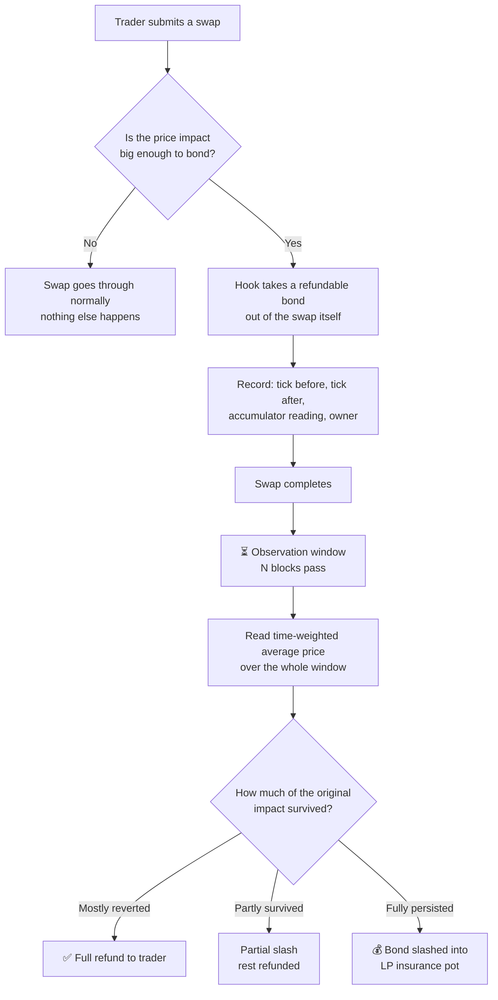
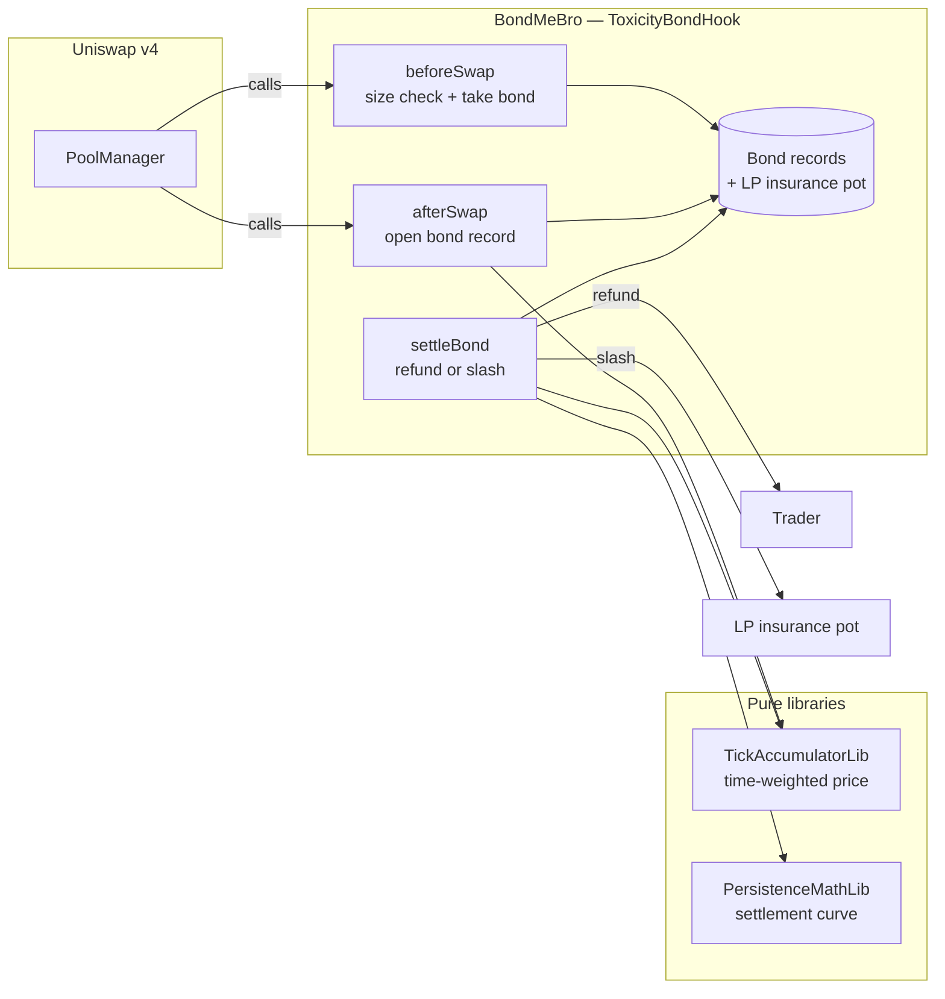

# BondMeBro

**Outcome-linked LP insurance for Uniswap v4.**

Big trades that move the price put down a refundable deposit. A little while later,
the hook checks what happened to the price. If it bounced back, the trade was
harmless and the deposit is returned in full. If the price stayed where the trade
pushed it, liquidity providers were hurt — and part of the deposit goes to them.

Contract: `ToxicityBondHook` · Built for UHI10 (Atrium Academy)

---

## The problem

When someone makes a large swap, the pool price moves. What happens next tells you
a lot about whether that trade hurt anyone:

- **The price bounces back.** The trade was just noise. Nobody was really harmed —
  the pool ends up roughly where it started.
- **The price stays there.** The trader knew something the pool didn't. They bought
  cheap (or sold expensive) against liquidity providers who had no way to react.
  This is called *adverse selection*, and it quietly eats LP returns.

The catch: you cannot tell these two apart **at the moment of the swap**. They look
identical. A big trade is a big trade. The difference only shows up afterwards.

Most fee-based solutions have to guess up front, so they end up charging everyone —
including harmless traders — for damage that only some of them cause.

## The idea

Don't guess. **Wait and see.**

BondMeBro asks high-impact swaps to post a refundable bond, then looks at the price
a short while later and settles based on what actually happened. Traders whose
impact reverted pay nothing. Traders whose impact stuck pay into an insurance pot
for LPs.

It's less "toxicity detection" and more **insurance that prices itself after the
fact**.

---

## How it works



### The three moments that matter

**1. Before the swap** — the hook checks how much the price is about to move. If
it's small, nothing happens and the swap proceeds as normal. If it's large, the
hook takes a bond directly out of the swap. No separate deposit transaction, no
router in front of the pool.

**2. After the swap** — the hook writes down where the price was before, where it
landed after, and a reading from the price accumulator. This record is what
settlement will later be judged against.

**3. After the observation window** — the hook compares the price now against the
price then, and works out what fraction of the original impact is still there.
That fraction decides the refund.

---

## Architecture



**Everything lives inside the hook.** There is no external oracle, no keeper bot,
no off-chain service, and no separate router contract. The hook reads the pool's
own price history and settles from it. That was a deliberate choice — comparable
projects add outside infrastructure, and every added dependency is another thing
that can break or be captured.

### The three source files

| File | What it does |
|---|---|
| `src/BondMeBro.sol` | The hook itself. Holds bond records and the insurance pot, and wires the swap callbacks together. |
| `src/libraries/PersistenceMathLib.sol` | The settlement curve. Pure math: given the tick before, the tick after, and a later reference tick, returns how much impact survived. |
| `src/libraries/TickAccumulatorLib.sol` | A single-slot time-weighted price accumulator. Provides the reference price for settlement. |

---

## Two design decisions worth explaining

### Why "how much survived" instead of "did it keep moving"

The first version of this hook only slashed when the price kept moving *further*
after the swap. That turned out to be exactly backwards. Think about the worst
case for an LP: a trade moves the price and it simply **stays there**. Under the
old rule, that case got a full refund — the hook was refunding the most harmful
trades.

The rule now measures the **persistence fraction**: what share of the original
price impact is still present at settlement, anchored to the ticks before and
after the swap. Price sticks, bond is slashed. Price reverts, bond comes back.

### Why a time-weighted average instead of just reading the price

If settlement read the price at a single instant, a trader could push the price
back where it started, trigger settlement, collect a full refund, and unwind — all
in one block, at almost no cost.

So settlement reads a **time-weighted average across the entire observation
window** instead. To fool it, you would have to hold the price for a meaningful
share of the window, paying arbitrageurs the whole time. The manipulation still
exists, but it stops being free.

---


## Getting started

**Clone with submodules.** Dependencies are pinned git submodules — without this
flag the `lib/` folders come down empty and the build fails.

```bash
git clone --recurse-submodules https://github.com/Maheshsiddu29/BondMeBro.git
cd BondMeBro
```

Already cloned without them?

```bash
git submodule update --init --recursive
```

**Build and test:**

```bash
forge build
forge test
```

**Run the full check** (the same gate CI runs):

```bash
make ci
```

### Environment variables

Create your own `.env` locally with the values you need for deployment:

- `RPC_URL` — the RPC endpoint for your target network
- `PRIVATE_KEY` — the deployer key
- `ETHERSCAN_API_KEY` — only if you want contract verification

`.env` is gitignored. Keep it that way.

### A note on deployment

Uniswap v4 encodes a hook's permissions into its **address**, so this can't be
deployed with a plain `forge create`. The deploy script mines a CREATE2 salt until
it finds an address carrying the right permission bits. Also note: changing the
constructor arguments changes the address, so expect to redeploy as the contract
evolves.

---

## Dependency note

`BaseHook` was **removed from `v4-periphery`** and now lives in
`OpenZeppelin/uniswap-hooks` at `src/base/BaseHook.sol`. Most tutorials still point
at the old path and will not work. Dependency commits in this repo are pinned
deliberately for that reason.

---

## License

See [LICENSE](./LICENSE).