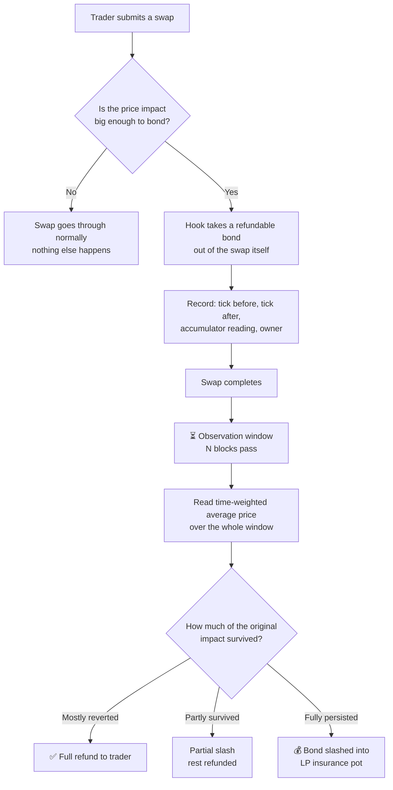
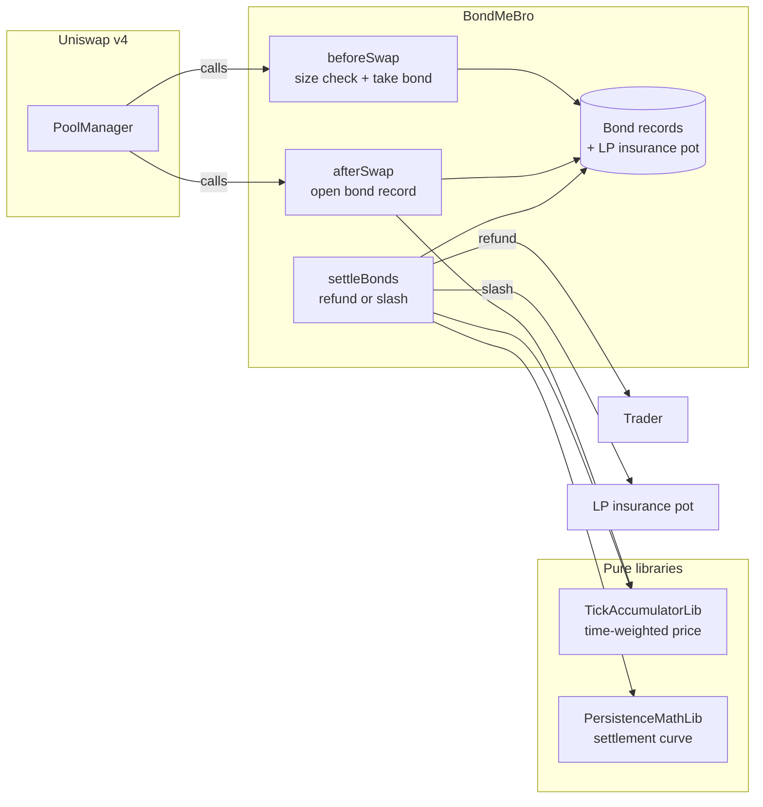

# BondMeBro

**Outcome-linked LP insurance for Uniswap v4.**

Big trades that move the price put down a refundable deposit. A little while later,
the hook checks what happened to the price. If it bounced back, the trade was
harmless and the deposit is returned in full. If the price stayed where the trade
pushed it, liquidity providers were hurt — and part of the deposit goes to them.

Contract: `BondMeBro` · Built for UHI10 (Atrium Academy)

---

## The problem

When someone makes a large swap, the pool price moves. What happens next tells you
a lot about whether that trade hurt anyone:

- **The price bounces back.** The trade was just noise. Nobody was really harmed —
  the pool ends up roughly where it started.
- **The price stays there.** The trader knew something the pool didn't. They bought
  cheap (or sold expensive) against liquidity providers who had no way to react.
  This is called *adverse selection*, and it quietly eats LP returns.

The catch: you cannot tell these two apart **at the moment of the swap**. They look
identical. A big trade is a big trade. The difference only shows up afterwards.

Most fee-based solutions have to guess up front, so they end up charging everyone —
including harmless traders — for damage that only some of them cause.

## The idea

Don't guess. **Wait and see.**

BondMeBro asks high-impact swaps to post a refundable bond, then looks at the price
a short while later and settles based on what actually happened. Traders whose
impact reverted pay nothing. Traders whose impact stuck pay into an insurance pot
for LPs.

It's less "toxicity detection" and more **insurance that prices itself after the
fact**.

---

## How it works



### The three moments that matter

**1. Before the swap** — the hook checks how much the price is about to move. If
it's small, nothing happens and the swap proceeds as normal. If it's large, the
hook takes a bond directly out of the swap. No separate deposit transaction, no
router in front of the pool.

**2. After the swap** — the hook writes down where the price was before, where it
landed after, and a reading from the price accumulator. This record is what
settlement will later be judged against.

**3. After the observation window** — the hook compares the price now against the
price then, and works out what fraction of the original impact is still there.
That fraction decides the refund.

---

## Architecture



**Everything needed for the mechanism lives inside the hook.** There is no required
external oracle, keeper bot, or off-chain service. The hook reads the pool's own
price history and settles from it; a router may still be used to execute swaps and
pass end-user identity in `hookData`. That was a deliberate choice — comparable
projects add outside infrastructure, and every added dependency is another thing
that can break or be captured.

### The three source files

| File | What it does |
|---|---|
| `src/BondMeBro.sol` | The hook itself. Holds bond records and the insurance pot, and wires the swap callbacks together. |
| `src/libraries/PersistenceMathLib.sol` | The settlement curve. Pure math: given the tick before, the tick after, and a later reference tick, returns how much impact survived. |
| `src/libraries/TickAccumulatorLib.sol` | A single-slot time-weighted price accumulator. Provides the reference price for settlement. |

---

## Two design decisions worth explaining

### Why "how much survived" instead of "did it keep moving"

The first version of this hook only slashed when the price kept moving *further*
after the swap. That turned out to be exactly backwards. Think about the worst
case for an LP: a trade moves the price and it simply **stays there**. Under the
old rule, that case got a full refund — the hook was refunding the most harmful
trades.

The rule now measures the **persistence fraction**: what share of the original
price impact is still present at settlement, anchored to the ticks before and
after the swap. Price sticks, bond is slashed. Price reverts, bond comes back.

### Why a time-weighted average instead of just reading the price

If settlement read the price at a single instant, a trader could push the price
back where it started, trigger settlement, collect a full refund, and unwind — all
in one block, at almost no cost.

So settlement reads a **time-weighted average across the entire observation
window** instead. To fool it, you would have to hold the price for a meaningful
share of the window, paying arbitrageurs the whole time. The manipulation still
exists, but it stops being free.

---

## Settlement liveness: no keeper is required

A bond becomes eligible after `observationBlocks`, but a blockchain will not call a
function by itself. BondMeBro handles both the normal and quiet-pool cases without
making a bot a protocol dependency:

1. **Piggyback settlement.** At the start of every later swap, the hook walks the
   FIFO queue and settles the matured prefix. The work is capped by
   `maxSettlesPerSwap` (never more than 32), so one unlucky swapper cannot be made
   to pay unbounded cleanup gas. The swap's resolved owner receives
   `settlerFeeBps` of each slash as compensation; the fee is never taken from a
   refund.
2. **Permissionless settlement.** Anyone can call `settleBonds(key, maxCount)`.
   The call is capped at 32 bonds and pays the caller `settlerFeeBps` of each
   slashed amount. The fee is taken only from the slash — a fully refunded bond
   refunds exactly its posted amount. This gives quiet pools a profitable liveness
   path while keeping settlement timing out of the bond owner's control.

Bonds are FIFO because maturity is monotonic in opening block. Settlement stops at
the first immature bond and never loops over an unbounded list in a swap. A late
settlement uses the accumulator's `observe()` extrapolation, so a quiet pool still
resolves rather than treating the reference as missing data. The resulting rule is
intentional: a price that moved and remained unchallenged is persistent under this
insurance model.

Slashed value is held in `insurancePot[poolId][currency]`. `donatePot` is
permissionless and sends the next manager-sized chunk of a currency to currently
in-range LPs through `PoolManager.donate`; repeated calls drain a very large pot.
This is an MVP distribution rule: LPs in range at donation time receive the funds,
not necessarily the exact LPs who were in range at the harmful swap.

## Accumulation safety: quiet pools, flash pushes, and drift

`TickAccumulatorLib` is updated on every swap, not only on bonded swaps. It credits
the elapsed blocks at the previous recorded tick, then moves the recorded tick
toward the raw post-swap tick by at most `maxAbsTickDelta`. The cap is **fixed per
touched block**, not multiplied by a quiet gap: a single swap after hours of silence
cannot write an arbitrarily large move into the oracle.

Only the first swap in a block updates the accumulator. That once-per-block rule
prevents a same-block series of swaps from ratcheting the reference through many
small moves. The cost is a bounded lag for a genuine large market move: the
reference converges at the configured clamp width. The clamp affects settlement
reference data only; the bond's `tickBefore` and `tickAfter` remain raw pool ticks.

A quiet pool is supported deliberately. `observe()` extrapolates the trailing
interval at `lastTick`, so no swaps during the window produces a valid TWA equal to
the last recorded tick. Truncation defeats a one-block flash push; it does not defeat
an attacker who pins the price for a meaningful fraction of the window. Window
length and arbitrage cost are the defense against that patient attack.

The reference is not a causal toxicity oracle. Market-wide drift and unrelated
flow are mixed into the pool-local TWA, so a trade with the market can look more
persistent and a trade against it can look more reverted. Fixing that would require
an external market-wide oracle. This limitation is documented and tested rather
than hidden behind a second slash model.

The accumulator uses `int56` for `tick * block` and `uint48` block numbers. At the
maximum Uniswap tick, an `int56` cumulative reaches its bound after about
`4.06e10` blocks: roughly 15,400 years at 12-second blocks and still about 322
years at 0.25-second blocks. A `uint48` block number also avoids the ~34-year wrap
that a `uint32` would have on a 0.25-second chain. Integer TWA division truncates
toward zero by at most one tick.

## Runtime configuration

All values are immutable constructor parameters, and therefore part of the CREATE2
salt calculation. Changing one means mining and deploying a new hook address.

| Parameter | Meaning |
|---|---|
| `bondBps` | Posted bond as basis points of the swap's unspecified-side amount |
| `minImpactTicks` | Minimum raw absolute tick impact that opens a bond |
| `refundTolTicks` | Noise floor used by the persistence curve |
| `observationBlocks` | Minimum age before a bond can settle |
| `maxAbsTickDelta` | Maximum recorded accumulator move per touched block |
| `settlerFeeBps` | Piggyback owner or permissionless settler's share of slashed value |
| `maxSettlesPerSwap` | Piggyback settlement budget, capped at 32 |

The deployment script reads these from `BOND_BPS`, `MIN_IMPACT_TICKS`,
`REFUND_TOL_TICKS`, `OBSERVATION_BLOCKS`, `MAX_ABS_TICK_DELTA`,
`SETTLER_FEE_BPS`, and `MAX_SETTLES_PER_SWAP`. Its defaults are conservative demo
values; production deployments should derive the clamp and window together from
expected volatility and the desired manipulation cost.

## Backend production runbook

The Solidity hook is the backend; it does not require a database or a mandatory
keeper service. An indexer or cron job can be added later as an operational
convenience because all important state changes are emitted as events.

### 1. Deploy the hook

Copy `.env.example` to `.env`, set `RPC_URL`, `PRIVATE_KEY`, and the target
`POOL_MANAGER`, then run:

```bash
source .venv/bin/activate  # only if using the Slither environment
forge script script/DeployBondMeBro.s.sol:DeployBondMeBro \\
  --rpc-url "$RPC_URL" \\
  --private-key "$PRIVATE_KEY" \\
  --broadcast
```

The script mines a CREATE2 address whose low bits match the hook permissions. The
printed `deployed` address is the value to use as `BOND_HOOK`. Never change an
immutable policy knob after mining without deploying a new hook address.

### 2. Create the pool and add liquidity

The pool key must contain sorted currencies, the chosen fee and tick spacing, and
`hooks = BOND_HOOK`. Initialize the pool with the included script:

```bash
forge script script/InitializeBondMeBroPool.s.sol:InitializeBondMeBroPool \\
  --rpc-url "$RPC_URL" \\
  --private-key "$PRIVATE_KEY" \\
  --broadcast
```

Then use the network's canonical PositionManager to add enough broad or otherwise
intentional liquidity for the expected price range. Pool creation and liquidity
provisioning are separate from hook deployment because the exact PositionManager,
Permit2, WETH, token approval, and slippage settings are network-specific.

### 3. Operate settlement

Set `BOND_HOOK`, `CURRENCY0`, `CURRENCY1`, `POOL_FEE`, and `TICK_SPACING` in the
environment. A public keeper or cron job can settle a quiet pool with:

```bash
forge script script/SettleBondMeBro.s.sol:SettleBondMeBro \\
  --rpc-url "$RPC_URL" \\
  --private-key "$PRIVATE_KEY" \\
  --broadcast
```

`MAX_COUNT` is optional and is capped by the contract at 32. Active pools do not
need this script because later swaps piggyback matured settlement.

### 4. Distribute the insurance pot

After settlement, set `POT_CURRENCY` to either pool currency and run:

```bash
forge script script/DonateBondPot.s.sol:DonateBondPot \\
  --rpc-url "$RPC_URL" \\
  --private-key "$PRIVATE_KEY" \\
  --broadcast
```

Large pots are intentionally donated in manager-sized chunks. Confirm that the
pool has in-range liquidity before calling; a failed donation leaves accounting
unchanged.

Before a production launch, run the full test suite, verify the deployed bytecode
and hook permissions, rehearse the runbook on a testnet, and obtain an independent
security audit. The current implementation is production-oriented MVP backend
code, not a formal audit or a guarantee against economic risk.

---

## Getting started

**Clone with submodules.** Dependencies are pinned git submodules — without this
flag the `lib/` folders come down empty and the build fails.

```bash
git clone --recurse-submodules https://github.com/Maheshsiddu29/BondMeBro.git
cd BondMeBro
```

Already cloned without them?

```bash
git submodule update --init --recursive
```

**Build and test:**

```bash
forge build
forge test
```

**Run the full check** (the same gate CI runs):

```bash
make ci
```

### Environment variables

Create your own `.env` locally with the values you need for deployment:

- `RPC_URL` — the RPC endpoint for your target network
- `PRIVATE_KEY` — the deployer key
- `POOL_MANAGER` — the deployed Uniswap v4 PoolManager address
- `ETHERSCAN_API_KEY` — only if you want contract verification

The deployment script also accepts the immutable policy knobs listed above as
optional environment variables. If an owner or settler receiver rejects a token or
native transfer, the hook records a pull payment in `claimablePayments`; that
recipient can retry with `claimPayments(currency)`.

`.env` is gitignored. Keep it that way.

### A note on deployment

Uniswap v4 encodes a hook's permissions into its **address**, so this can't be
deployed with a plain `forge create`. The deploy script mines a CREATE2 salt until
it finds an address carrying the right permission bits. Also note: changing the
constructor arguments changes the address, so expect to redeploy as the contract
evolves.

---

## Dependency note

`BaseHook` was **removed from `v4-periphery`** and now lives in
`OpenZeppelin/uniswap-hooks` at `src/base/BaseHook.sol`. Most tutorials still point
at the old path and will not work. Dependency commits in this repo are pinned
deliberately for that reason.

---

## License

See [LICENSE](./LICENSE).