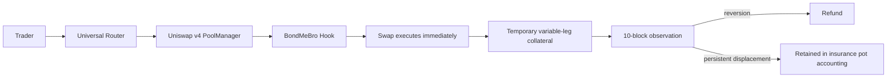

# BondMeBro

**Outcome-linked refundable collateral for Uniswap v4.**

BondMeBro is a Uniswap v4 hook that asks qualifying price-moving swaps to post **temporary, refundable collateral**. The swap executes immediately; the hook observes the pool's post-trade price path for a fixed **10-block** window and later returns or retains collateral according to the displacement that survives. The mechanism is pool-local and deterministic: it does **not** try to identify a malicious wallet, infer intent, or depend on an external price oracle.

> **Immediate swap. Temporary collateral. Conditional refund.**

## Submission snapshot

- Repository: `https://github.com/Maheshsiddu29/BondMeBro`
- Submission branch: `main`
- Submission commit: `baf1a4b`
- Network: **Unichain Sepolia** (`chainId = 1301`)
- Hook: [`0x2A07B25994FdE4c772f00d6B89e05E8ad62650C4`](https://sepolia.uniscan.xyz/address/0x2A07B25994FdE4c772f00d6B89e05E8ad62650C4)
- Pool ID: `0xf7c593b94a9389133e5a12e30a199de8947996076d3c97f3080b04dd5fe6f51f`
- Supported demo scope: **single-hop ERC20 ↔ ERC20, exact-input and exact-output**

## Why BondMeBro?

AMM LPs can be adversely selected when a pool is stale relative to new market information. An informed or arbitrage trade can trade against that stale quote, move the pool, and leave passive LPs holding the loss while the arbitrageur captures the repricing opportunity. This is closely related to the **loss-versus-rebalancing (LVR)** view of AMM adverse selection.

The hard problem is attribution: after a trade, a hook only sees the pool's realized path. That path can contain surviving trade impact, market drift, unrelated later flow, and noise. BondMeBro therefore avoids the claim that it can "detect toxic traders." Instead, it implements **outcome-linked LP risk sharing**:

1. measure realized impact;
2. post bounded refundable collateral;
3. observe a short late window;
4. refund when displacement reverts;
5. retain collateral when displacement persists.

## Core mechanism



### 1. Variable-leg custody

BondMeBro does not alter the trader's specified leg.

| Swap mode | Specified leg | Variable leg | Collateral currency |
|---|---|---|---|
| Exact input | Input stays fixed | Output | Output token |
| Exact output | Output stays fixed | Input | Input token |

`beforeSwap` returns zero custom delta. After the native swap has produced the real execution result, `afterSwap` computes the bond and returns it on the **unspecified/variable leg**.

### 2. Block-aware impact

For each swap:

```text
ownImpact         = abs(tickAfter - tickBefore)
blockDisplacement = abs(tickAfter - blockStartTick)
effectiveImpact   = max(ownImpact, blockDisplacement)

collateralBps = min(100, ceil(effectiveImpact * 25 / 100))
```

This is **0.25 bps per effective impact tick**, capped at **100 bps = 1%** of the realized variable leg.

`blockStartTick` is latched on the first pool touch in a new block. Using the larger of own-swap impact and same-block displacement materially reduces the advantage from splitting a single move into many same-block swaps. It is a mitigation, **not** a claim of split-proofness.

### 3. HookData v2

The refund destination is explicit and router-safe:

```text
byte 0      uint8    version = 2
bytes 1-20  address  refundRecipient
bytes 21-36 uint128  maxBondAmount
-----------------------------------
37 bytes total, packed
```

The hook never derives the refund recipient from `msg.sender`, the router, or `tx.origin`.

### 4. 10-block settlement

A bond opens at block `O` and matures at `M = O + 10`.

```text
O -------- C6 -------- C8 -------- C10 = M
           O+6         O+8          O+10
```

Only two late two-block windows determine the residual:

```text
late1 = direction-aligned displacement over C6 -> C8
late2 = direction-aligned displacement over C8 -> C10
R     = max(max(late1, 0), max(late2, 0))
```

A 5-tick catch-up dead zone handles very small residual noise without permanently subtracting tolerance from larger displacements:

```text
R <= 5       => Q = 0
5 < R < 10   => Q = 2 * (R - 5)
R >= 10      => Q = R

targetSlashBps = ceil(Q * 25 / 100)
slashBps       = min(collateralBps, targetSlashBps)
```

Token accounting is derived from the realized variable leg:

```text
collateral = floor(variableLegAmount * collateralBps / 10_000)
slash      = min(collateral,
                 floor(variableLegAmount * slashBps / 10_000))
refund     = collateral - slash
```

Settlement is **permissionless**. The result is tied to frozen/derivable C6/C8/C10 endpoints, so post-maturity swaps and settlement delay cannot change the answer.

### 5. Quiet pools

A quiet pool is **not automatically refunded**. The accumulator extrapolates using the last observed tick when no swap crosses an endpoint. If the last price remains displaced, the bond remains slashable. This avoids making "no activity" an escape hatch.

## Live proof on Unichain Sepolia

### Full-refund case

A live exact-input trade moved the pool **189 ticks**. A reverse trade restored the pool before the first late checkpoint.

| Item | Value |
|---|---|
| Bond | `0xe288648eba538c8c1b37efa1f9906b7e44ecaf062cf0388a15c03ac50df424ef` |
| Forward tx | `0x51e461a7901bddd15ef8b3c4d7a335c9882ca6bdc2e2f3c00215d2dddd14b125` |
| Open block | `61632823` |
| Reverse tx | `0xe29f227dda7afe83dbdedb0664225cde7964bdd4cb4514e70136a11c3a5bd448` |
| Reverse block | `61632828` (`open + 5`) |
| C6 | `61632829` |
| Maturity | `61632833` |
| Variable leg | `3.582082322703465400 bWETH` |
| Collateral rate | `48 bps` |
| Collateral | `0.017193995148976633 bWETH` |
| Settlement tx | `0xdfbf7ca82cfb69c637716aa37b9d607644374a3770f903d2973dadc6453ad58a` |
| Refund | `0.017193995148976633 bWETH` |
| Slash | `0` |

**Result: 100% of the posted collateral was refunded.**

### Persistent-displacement cases

Multiple live bonds were also allowed to mature while the test pool remained displaced. Those settled with **0 refund** and retained the posted collateral, demonstrating the opposite branch of the same mechanism.

## Research evolution

BondMeBro's final mechanism is the result of several rejected or superseded designs:

| Research path | Finding | Final decision |
|---|---|---|
| Wallet/intent classification | Pool-local data cannot identify intent or reconstruct the counterfactual fair price | Do not classify wallets; price realized outcomes |
| External oracle/reference venue | Improves attribution but introduces dependency and trust assumptions | Excluded from MVP |
| Dynamic fee / non-refundable premium | Decides cost before outcome and is not refundable | Rejected |
| Decaying impact accumulator | Catches naive splitting but has a false-positive/evasion trade-off | Not used as final detector |
| Whole-window residual | Carries opening-block structural floor | Rejected |
| Single late window | One opposing late block can erase the charge | Rejected |
| Relative tolerance / denominator-based settlement | Good synthetic cohort fairness, but overshoot-and-unwind can reduce or erase absolute slash | Superseded |
| Permanent-subtraction dead zone | Never catches up to the base curve | Rejected |
| **Model L2** | Impact-scaled collateral + residual-linked absolute slash + two late windows + catch-up dead zone | **Final** |

The most important research lesson is that **opening impact should determine collateral availability, while surviving late displacement should determine the amount lost**. Increasing the opening impact must not reduce absolute slash for the same surviving residual.

## Synthetic economic evidence

> **Important:** these are deterministic synthetic simulations, **not historical Uniswap evidence**.

The final Model L2 `D = 5` research campaign used **8 regimes × 4 seeds × 80,000 trades per world** (2.56 million distinct generated trades), plus adversarial grids.

Selected results:

- benign full-refund rate: **85.82%**;
- average benign loss: **0.619 bps of gross**;
- useful modeled LP compensation: **53.73%**;
- harmful trades charged nothing: **4.61%**;
- p99 benign loss: **11.62 bps of gross**;
- overshoot grid: **0 of 3,150 rows** lowered absolute slash;
- a single final-block opposing push reduced slash by **0%** in the tested L2 construction.

These results support the *shape* of the mechanism. They do not establish historical LP savings, optimal mainnet parameters, or profitability of every manipulation strategy.

## Same-block splitting: mitigation, not elimination

The original per-trade impact model allowed a 58-tick move split into 32 pieces to reduce posted collateral by about **15×**. The production block-aware model reduced the measured dilution to about **1.88×** in the same fixture. Aggregate slash also improved materially, but a residual advantage remains. The README and paper therefore deliberately avoid the phrase "split-proof."

## Mixed-decimal safety (BMB-01 remediation)

A pre-release security review identified an availability failure: exact-input collateral is in the **output** token, while input-only thresholds cannot guarantee that the variable leg is large enough to produce non-zero collateral on mixed-decimal pairs.

The final config separates the two concerns:

- `minBondedAmount0/1` — minimum actual input, in the input token's raw units;
- `minVariableLeg0/1` — minimum variable/collateral leg, in that leg's raw units;
- variable-leg minimums are bounded to at least **10,000 raw units** when bonding is enabled.

This keeps eligibility correct for both directions and both exact-input/exact-output modes.

## Security properties

The implementation and adversarial tests exercise the following properties:

- `refund + slash == collateral`;
- a bond settles at most once;
- refund destination is the stored HookData v2 recipient;
- settlement caller cannot redirect value;
- post-maturity swaps cannot change the result;
- quiet settlement and late settlement produce the same endpoints/result;
- collateral is strictly inside the variable leg (`INV-NOOP-VL`);
- aggregate shared-currency liabilities remain solvent;
- malformed HookData is rejected;
- exact-input and exact-output preserve the specified leg;
- same-block impact never receives a discount below own-impact collateral;
- production swap callbacks remain bounded in work with respect to total bond count.

### Known limitations

This is a **Hookathon/testnet implementation, not a mainnet security guarantee**. Known limitations include:

1. **Two-block late-window straddle:** manipulating both adjacent late windows can reduce the residual; it requires sustained movement across two consecutive late blocks, but it is not impossible.
2. **Temporal grinding under `D = 5`:** movement accumulated in small enough steps can avoid charge; fees, gas, and arbitrage exposure determine real profitability.
3. **1% collateral cap:** very large displacements can exceed the amount that can be economically covered by the posted collateral.
4. **Threshold splitting:** swaps below eligibility thresholds remain unbonded by design.
5. **Same-block split dilution:** materially reduced, not eliminated.
6. **Insurance-pot distribution:** retained collateral is accounted to an insurance/risk reserve; automatic LP distribution is future work.
7. **Unsupported assets/routes:** native currency, multi-hop, fee-on-transfer, rebasing, and callback-style nonstandard tokens are outside the current demo scope.

## Hook permissions

The deployed hook uses the low-14-bit permission mask:

```text
0x10C4
```

Enabled paths:

- `afterInitialize`
- `beforeSwap`
- `afterSwap`
- `afterSwapReturnDelta`

`beforeSwapReturnDelta` is intentionally **not** enabled.

## Live deployment

| Component | Address |
|---|---|
| BondMeBro hook | `0x2A07B25994FdE4c772f00d6B89e05E8ad62650C4` |
| PoolManager | `0x9cB26A7183B2F4515945Dc52CB4195B0d2D06C95` |
| Universal Router | `0x7F9B8D606E0F35E5073ABf93695814530b28a37b` |
| V4Quoter | `0xB2b34025a07af3925313b6B46f8046Ee8FfBa30B` |
| StateView | `0x792d13207744f132943cdde4d37ec89f20ae3b0d` |
| Permit2 | `0x000000000022D473030F116dDEE9F6B43aC78BA3` |
| bWETH (`currency0`) | `0x38293A5D8A879Af5e2Eb2D3eb80121CA82f6acC1` |
| bUSDC (`currency1`) | `0x49d5E60035e13b3736e5D26ef7ecEAbA52f9cC39` |

Demo pool:

```text
Pool ID      0xf7c593b94a9389133e5a12e30a199de8947996076d3c97f3080b04dd5fe6f51f
Fee          3000 (0.30%)
Tick spacing 60
Pool block    61620842
```

## Run locally

### Prerequisites

- Foundry
- Node.js + npm
- Git submodules

### Clone and contracts

```bash
git clone --recurse-submodules https://github.com/Maheshsiddu29/BondMeBro.git
cd BondMeBro

forge build
forge test -vv
forge test --match-path 'test/invariant/*' -vv
```

Optional static analysis:

```bash
slither .
```

### Frontend

Create `frontend/.env.local` **locally only** (never commit it):

```bash
RPC_URL=https://sepolia.unichain.org
RPC_RATE_LIMIT=1200
NEXT_PUBLIC_CHAIN_ID=1301
NEXT_PUBLIC_NETWORK_NAME=Unichain Sepolia
NEXT_PUBLIC_EXPLORER_URL=https://sepolia.uniscan.xyz
NEXT_PUBLIC_HOOK_ADDRESS=0x2A07B25994FdE4c772f00d6B89e05E8ad62650C4
NEXT_PUBLIC_POOL_MANAGER=0x9cB26A7183B2F4515945Dc52CB4195B0d2D06C95
NEXT_PUBLIC_UNIVERSAL_ROUTER=0x7F9B8D606E0F35E5073ABf93695814530b28a37b
NEXT_PUBLIC_QUOTER=0xB2b34025a07af3925313b6B46f8046Ee8FfBa30B
NEXT_PUBLIC_PERMIT2=0x000000000022D473030F116dDEE9F6B43aC78BA3
NEXT_PUBLIC_CURRENCY0=0x38293A5D8A879Af5e2Eb2D3eb80121CA82f6acC1
NEXT_PUBLIC_CURRENCY1=0x49d5E60035e13b3736e5D26ef7ecEAbA52f9cC39
NEXT_PUBLIC_POOL_FEE=3000
NEXT_PUBLIC_TICK_SPACING=60
NEXT_PUBLIC_DEPLOYMENT_BLOCK=61620842
NEXT_PUBLIC_POOL_ID=0xf7c593b94a9389133e5a12e30a199de8947996076d3c97f3080b04dd5fe6f51f
```

Then:

```bash
cd frontend
npm ci
npm run abi:check
npm run lint
npm run typecheck
npm run test
npm run dev
```

## Live refund rehearsal

The repository includes testnet-only automation under `script/live-refund-demo/` and a deterministic fork rehearsal at `test/fork/LiveRefundRehearsal.t.sol`.

Plan against an explicit live block:

```bash
export LIVE_FORK_BLOCK=$(cast block-number --rpc-url https://sepolia.unichain.org)

UNICHAIN_SEPOLIA_RPC_URL=https://sepolia.unichain.org \
LIVE_FORK_BLOCK=$LIVE_FORK_BLOCK \
forge test --match-path 'test/fork/LiveRefundRehearsal.t.sol' -vv
```

The live script deliberately fails closed if the plan is stale or the wallet is not prepared.

## Validation snapshot

Final submission baseline:

- **492 contract tests passed**;
- **26 invariant-suite tests passed**;
- **Slither: 0 findings**;
- deployed hook runtime: **16,446 bytes**;
- production Solidity remained frozen while the final frontend/demo workflow was merged.

These are engineering validation results, not a claim of formal verification or a third-party mainnet audit.

## Project structure

```text
src/                         production hook + libraries
script/                      deployment scripts
script/live-refund-demo/     testnet refund automation
test/                        unit/integration/adversarial/invariant tests
frontend/                    Next.js demo frontend
docs/                        integration/research documentation (recommended)
```

## Research paper

See [`docs/BondMeBro_Research_Paper.md`](docs/BondMeBro_Research_Paper.md) for the full research evolution, final mechanism, synthetic evidence, adversarial findings, live deployment case study, and limitations.

## What BondMeBro does not claim

BondMeBro does **not** claim to:

- identify a malicious or "toxic" wallet;
- reconstruct an external fair price;
- eliminate all MEV, sandwiches, or frontrunning;
- be manipulation-proof or split-proof;
- automatically distribute retained collateral to LP positions;
- provide historical-mainnet LP savings estimates from the synthetic experiments;
- be mainnet production-ready without further economic calibration and external security review.

## References

1. Adams et al., **Uniswap v4 Core**, Uniswap v4 whitepaper.
2. Uniswap Developers, **Uniswap v4 Architecture and Hooks**.
3. Milionis, Moallemi, Roughgarden, Zhang, **Automated Market Making and Loss-Versus-Rebalancing**, arXiv:2208.06046.
4. Milionis, Moallemi, Roughgarden, **Automated Market Making and Arbitrage Profits in the Presence of Fees**, arXiv:2305.14604.

## License

See the repository's [`LICENSE`](LICENSE) file and the licenses of the pinned Uniswap dependencies.
